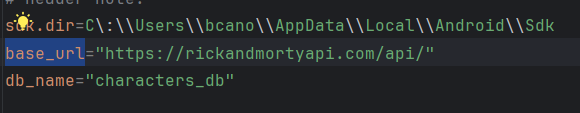

# Proyecto Android usando Clean Architecture, MVVM con Jetpack Compose.

El siguiente proyecto, es una pequeña muestra sobre la implementación de consumo de api rest desde android, usando buenas prácticas
y patrones de diseño que permiten realizar codigo limpio, sostenible y reusable para futuras features.

Para el desarrollo del MVP, se utilizo para la UI Jetpack Compose, como patrón de diseño se uso MVVM y arquitectura o estructura del
proyecto Clean Architecture, permitiendo una mejor separación y mantenibilidad del código, así también el uso de estados para 
determinar y manejar los diferente escenarios o flujos que pueden existir en la App.

A continuación, se detallan a alto nivel las caracteristicas más importantes utilizadas en la elaboración del proyecto.

## Caracteristicas del proyecto.
Para tener un proyecto de android jetpack compose sostenible y mantenible es necesario implementar buenas prácticas y patrones
de diseño que permitan la mejora continua del producto. Dicho esto, se detallan patrones de diseño y otras caracteristicas utilizadas.

- MVVM en Android.
- Jetpack Compose.
- Clean Architecture.
- Dependency Injection.
- Interface Segregation.
- DataSources (Local y Remote)
- SQL (Para repositorio local)

Las librerías o clases utilizadas para la creación del proyecto fueron:
- Room (Database)
- Retrofit (Request HTTP Client)
- Moshi (Convertidor de JSON a objetos de Kotlin)
- Result (Clase de kotlin para el uso Either<Success, Failure> separar los resultados y los fallos)
- ViewModel y Coroutines
- Hilt Android (Inyección de dependencias)

# Compilación o ejecución.
Para este proyecto se utilizo OS de Windows y Android Studio Koala | 2024.1.1

Para compilar el proyecto y ejecutarlo, primero se debe de crear un emulador de Android, esto puede realizarse desde Android Studio.

[Configurar emulador Android](https://developer.android.com/studio/run/managing-avds?hl=es-419)

Luego es necesario abrir la aplicación de Android Studio, importar el proyecto y el IDE automáticamente descargara las dependencias.

Posterior a ello solo hace falta seleccionar el emulador configurado previamente y presionar el botón run app o bien la combinación de
teclas Shift+F10 para ejecutar la app en el emulador.

Cabe mencionar que si, clonas el proyecto no se ejecutara de manera satisfactoria.

Es necesario agregar en el archivo local.properties la url de la api y el nombre de la base de datos.

Debera de tener este aspecto.



```base_url="<url>"```
```db_name="<nombre_db>"```

Listo! ya corrió la app.


## Funcionamiento de app usando la Api de Rick and Morty.


Existen 3 estados para la obtención de los datos desde la api y poder visualizarlos en la UI de la App.

### Estado inicial o de carga.
Cuando se hace la solicitud al servicio web Api rest o bien a la base de datos, se muestra el estado de carga con un circular progress bar
indicando al usuario que debe esperar para obtener los resultados.


### Estado satisfactorio.

Cuando la app funciona correctamente muestra en la UI un listado de los personajes de Rick and Morty.


### Estado de error.

Si la app falla u ocurre una excepción, se muestra un mensaje con el error, es buena práctica no mostrar al usuario
excepciones de codigo si no mensajes mas amigables y utilizar Excepciones personalizadas.


